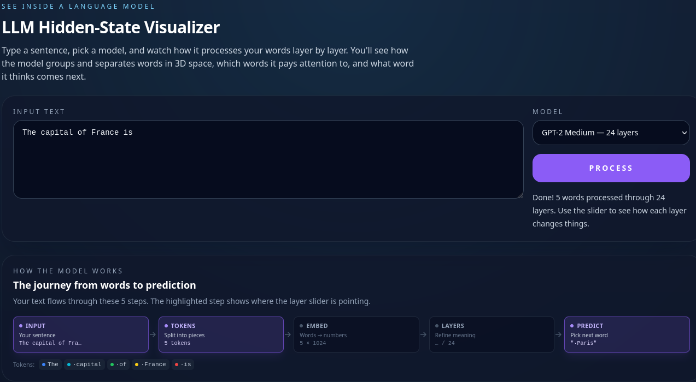
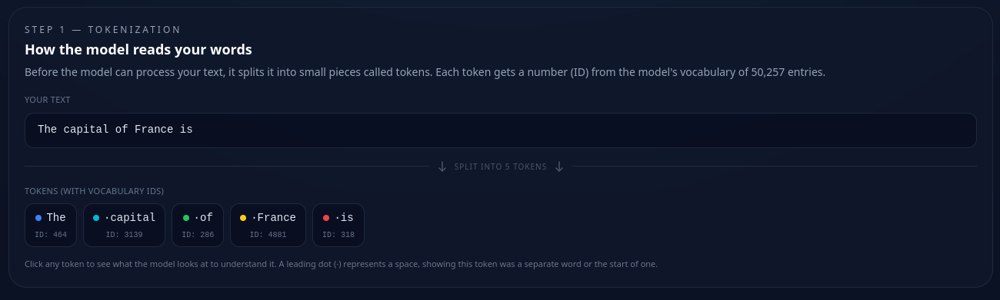
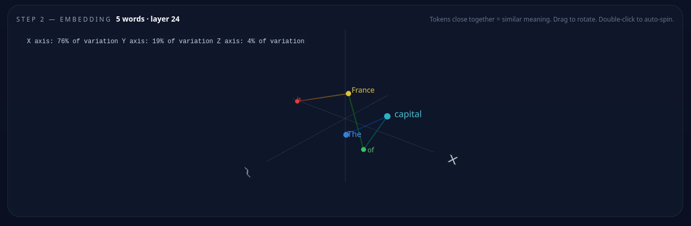
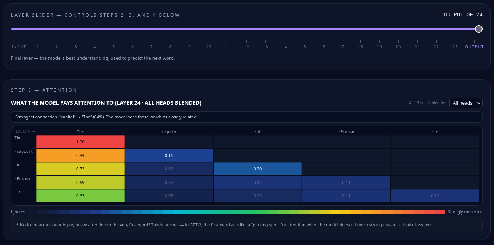
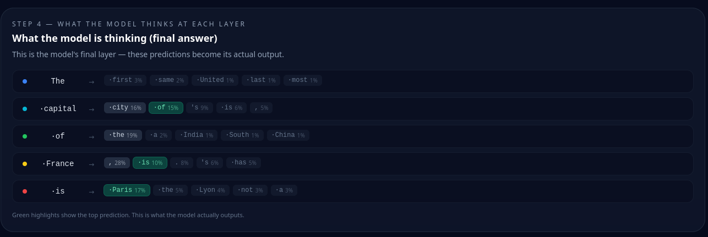
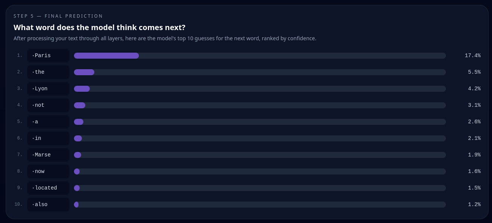

# LLM Anatomy

An interactive visualizer that lets you see inside a language model as it processes text. Type a sentence, run it through GPT-2 Medium, and watch every step of the transformer pipeline.



## Features

**Interactive pipeline flow** A visual pipeline strip shows all 5 processing steps (Input, Tokens, Embed, Layers, Predict) with the current step highlighted. Gives you a bird's-eye view of where you are in the model.

**Tokenization viewer** See exactly how the model splits your text into tokens, each with its vocabulary ID out of 50,257 entries. Click any token to track how the model processes it through every layer. A leading dot (·) shows where the tokenizer saw a word boundary.



**3D embedding space** Hidden states at any layer projected into 3D via PCA. Tokens that the model considers semantically similar cluster together. Drag to rotate, double-click to auto-spin. Variance percentages show how much information each axis captures. Scrub the layer slider to watch tokens rearrange as the model refines its internal representation.



**Layer slider** A scrubber across all 24 transformer layers (plus the input embedding). Moving the slider updates the 3D embedding, attention heatmap, and logit lens in real time so you can watch the model's understanding develop layer by layer.

**Attention heatmap** Shows which tokens the model connects to each other at each layer. View all 16 attention heads blended together or drill into individual heads with the dropdown. Color scale runs from "ignores" (blue) to "strongly connected" (red). Includes explanatory notes for example, GPT-2's tendency to park attention on the first token as a default when it doesn't have a strong reason to look elsewhere.



**Logit lens** Applies the model's output head to intermediate hidden states at every layer, revealing what the model would predict if it stopped at that layer. Watch predictions evolve from random noise at early layers to confident, coherent guesses by the final layer. Green highlights mark each token's top prediction.



**Top-K predictions** The model's top 10 next-word predictions ranked by confidence after softmax, displayed as a bar chart. This is the final output and what the model actually thinks comes next.



**Context view** Click a token in the tokenization step to see which other tokens it draws information from via attention, ranked by weight. Shows the top 5 context sources with their attention scores.

**Model caching** The backend keeps loaded models in memory. Switching back to a previously loaded model is instant no re-download or re-initialization.

## Installation

### Prerequisites

- **Python 3.10+** with pip
- **Node.js 18+** or **Bun** (recommended)
- ~2 GB of disk space (PyTorch CPU wheels + GPT-2 Medium weights)

### Clone the repository

```bash
git clone https://github.com/HexRav3n/LLM-Anatomy.git
cd LLM-Anatomy
```

### Install the backend

```bash
cd backend
python3 -m venv .venv
source .venv/bin/activate
pip install --upgrade pip
pip install -r requirements.txt --extra-index-url https://download.pytorch.org/whl/cpu
```

This installs FastAPI, PyTorch (CPU-only), and HuggingFace Transformers. First install downloads ~300 MB of PyTorch wheels.

### Install the frontend

```bash
# From the project root
bun install
```

Or with npm:

```bash
npm install
```

## Running

You need two terminals — one for the backend, one for the frontend.

### Start the backend

```bash
cd backend
source .venv/bin/activate
uvicorn main:app --host 127.0.0.1 --port 8000 --reload
```

Or use the convenience script (creates the venv and installs deps automatically):

```bash
cd backend
./run.sh
```

The first time you process text, the backend downloads GPT-2 Medium weights (~500 MB) from HuggingFace. This is a one-time download — the model is cached on disk and in memory after that.

### Start the frontend

```bash
# From the project root
bun dev
```

Or with npm:

```bash
npm run dev
```

### Open the app

Go to [http://localhost:5173](http://localhost:5173). Type a sentence, pick a model, click **Process**, and explore.

The Vite dev server proxies all `/api` requests to the backend at `http://127.0.0.1:8000`.

### Build for production

```bash
bun run build
```

Static files land in `dist/`. Serve them with any static file server and proxy `/api` requests to the backend.

## How it works

1. You type a sentence and click **Process**
2. The frontend sends the text and model ID to `POST /api/forward`
3. The backend tokenizes the input, runs a full forward pass with `output_hidden_states=True` and `output_attentions=True`, and extracts:
   - Token IDs and decoded text
   - Hidden states from all 25 layers (input embedding + 24 transformer layers)
   - Attention matrices from all 24 layers (16 heads each)
   - Logit lens projections at every layer (top-5 vocabulary predictions per token per layer)
   - Top-10 next-token predictions from the final layer
4. The frontend receives the full payload and renders each visualization
5. The layer slider reactively updates the 3D embedding, attention heatmap, and logit lens views as you scrub through layers

## Tech stack

| Component | Technology |
|-----------|------------|
| Frontend | React 18, TypeScript, Vite |
| 3D rendering | Three.js via React Three Fiber + Drei |
| Styling | Tailwind CSS |
| PCA projection | ml-pca |
| Backend | FastAPI, Uvicorn |
| Model inference | PyTorch (CPU), HuggingFace Transformers |
| Model | GPT-2 Medium (24 layers, 16 heads, 1024-dim hidden states) |

## License

MIT
